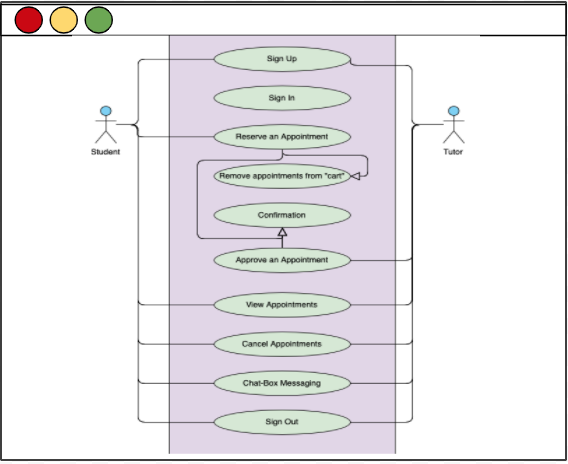

# Road2A

 | Application Images:         |  Use Case Diagram:  |
:-------------------------:|:-------------------------:
  |  
  |  

## Problem Statement:
Students and tutors may encounter communication difficulties when signing up or canceling sessions.

## Product Objective:
Create an appointment system for students and tutors to schedule/approve/cancel tutoring appointments with ease through calendar and chat box features. These main features will help eliminate communication problems and save time for tutors and students.

## Functional Requirements:
* Students should be able to sign up for at least 1 session per week.
* Students should be able to view sessions' vacancies at least 2 weeks in advance.
* Tutors should be informed of upcoming sessions at least 2 days prior to the scheduled time and date.
* Tutors should be able to notify students when they are not available (ex: emergency).
* Students and tutors should be able to cancel upcoming sessions at least 1 day prior to the scheduled time and date.
* Students should be able to chat with their tutors with the Messaging chat bar. 

## Non-functional Requirements:
* The website must have limited accessibility - only SJSU students can use the website. 
* The website must be maintained every 6 months with updated features (ex: graphics, fixed bugs).
* Students and tutors must be able to recover their login info (serviceability).
* The website must be available to Students and Tutors 90% of the time (reliability). 
